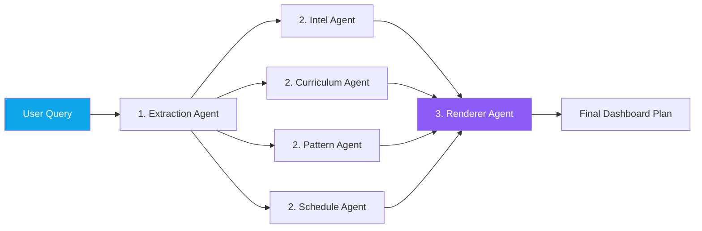

<div align="center">
  

  <h1>🎯 PrepAI: Your Personal Interview Tracker </h1>
  <p>
    <b>An AI-powered interview preparation assistant using LangGraph, React, and FastAPI.</b>
  </p>
  <p>
    <a href="#about-the-project">About</a> •
    <a href="#tech-stack">Tech Stack</a> •
    <a href="#how-it-works">How It Works</a> •
    <a href="#getting-started">Getting Started</a>
  </p>
</div>

---

## 🚀 About the Project

**PrepAI** is a smart, interactive AI dashboard that builds a customized, day-by-day interview preparation roadmap—tailored to the specific company, role, and timeline you provide! 

If you are a student aiming for a Software Engineering role at Google or a startup, you just type: *"Software Engineer at Google, 30 days."* PrepAI's specialized "agents" will research the company, create a realistic daily schedule, pull LeetCode pattern topics, and instantly generate a beautifully styled study guide right in your web browser. 

We built this project as a **multi-agent pipeline**. Instead of having one giant AI brain do everything slowly, we assign different AI "departments" (agents) to do specific jobs all simultaneously, making the generation lightning fast!

## 🛠️ Tech Stack

This project is split into two halves: the **Frontend** (what you see in the browser) and the **Backend** (the server that does the heavy lifting).

**Frontend (The Visual UI):**
- ⚛️ **React + Vite** – Blazing fast web framework
- 🎨 **Tailwind CSS** – For gorgeous modern styling 

**Backend (The Brain):**
- 🐍 **Python + FastAPI** – Builds the API endpoints
- 🦜 **LangGraph & LangChain** – Orchestrates the AI agents
- ⚡ **Groq API (Llama 3)** – Incredibly fast LLM processing
- 🍃 **MongoDB** – Stores all your personalized roadmaps securely
- 📦 **UV** – Modern, ultra-fast Python package manager

---

## 🧠 How It Works

We use **LangGraph** to connect multiple AIs together. Think of it like a factory assembly line:



1. **Extraction Agent**: Extracts exactly what you requested (Company, Role, Days).
2. **Workers (Intel, Curriculum, Pattern, Schedule)**: Four separate AI models research their designated topics in parallel using tool-calling and web searches.
3. **Renderer**: Gathers all data into a beautiful interactive HTML schedule, pushing the result to your React frontend!

---

## 🏃‍♀️ Getting Started

Even if you are a first-year engineering student, you can easily run this on your personal computer! Just follow these step-by-step instructions.

### 1. Prerequisites

Before starting, install these tools if you don't have them:
* [Git](https://git-scm.com/downloads) - To clone the code
* [Node.js](https://nodejs.org/) - To run the React frontend
* [Python (3.10+)](https://www.python.org/downloads/) - To run the background AI code
* [uv](https://github.com/astral-sh/uv) - Python's fastest package manager

### 2. Get API Keys (Free!)

You need three free API keys to allow the app to actually reach out and use the AI models:
1. **Groq API Key**: Go to [console.groq.com](https://console.groq.com) and create an API key. 
2. **Tavily API Key**: Go to [tavily.com](https://tavily.com) to allow your AI to search the internet. 
3. **MongoDB Connection String**: Go to [mongodb.com](https://mongodb.com), create a free tier cluster, and copy your connection string URL. 

---

### 3. Setting Up the Backend

Open your terminal (Command Prompt or VSCode Terminal) and run:

```bash
# Clone the repository
git clone https://github.com/620593/interview-prep.git

# Move into the project directory
cd interview-prep/interview-prep-agent

# Set up your environment variables
# Create a .env file locally 
echo GROQ_API_KEY=your_key_here >> .env
echo TAVILY_API_KEY=your_key_here >> .env
echo MONGO_URI=your_mongo_url_here >> .env

# Install dependencies using `uv`
uv sync

# Run the FastAPI server!
uv run uvicorn backend.src.main:app --reload --port 8000
```
*You should now see the server start. Keep this terminal open!*

---

### 4. Setting Up the Frontend

Open a **new, second completely separate terminal window** and run:

```bash
# Ensure you are back inside the main interview-prep-agent folder
cd "interview-prep-agent/frontend"

# Install all the necessary packages for React
npm install

# Start the frontend dashboard in Developer Mode
npm run dev
```

*You can now open `http://localhost:5173` in your web browser. Type your dream job into the Prompt bar, wait 30 seconds for the AIs to talk to each other, and receive your personalized roadmap!*

---

<div align="center">
  <p><i>Made with ❤️ for engineering students and interview candidates everywhere.</i></p>
</div>
